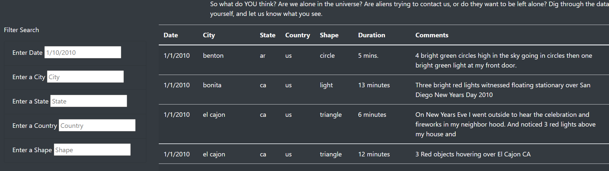
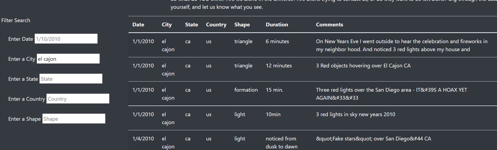
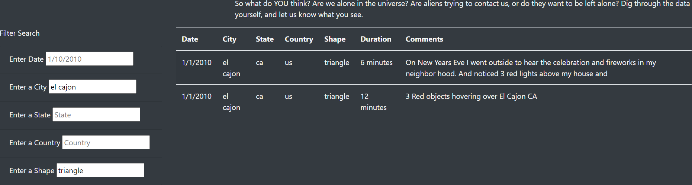

# UFOs

## Overview
The client has created a web page with tabulated data for UFO sightings. They have made the table dynamic; we can filter the UFO sightings by date. The client would like to make the table more interactive by adding filters for city, state, and shape. 

## Purpose
To create a more dynamic UFOs sightings table by adding filters for city, state, country, and shape using Javascript.

## Results & Analysis
The initial web page already had the date filter and a button to filter the results. In the new version, the HTML code was updated to add the city, state, country, and shape filters. The filter button was removed. 

When the user lands on the page, the table is populated. 

Once the user enters their desired filter, they can simply hit enter or navigate away from the search box and the table will filter the results based on their entry.

They can further drill down their results by adding an additional filter.

If they would like to perform a new search, they can remove all their filters and the table will return to the initial unfiltered view.

## Summary
One drawback of this new design is that it filters the results based on criteria 1 AND criteria 2. It is not possible to filter for criteria 1 OR criteria 2.

To improve upon this design, the following can be added/modified:

- 